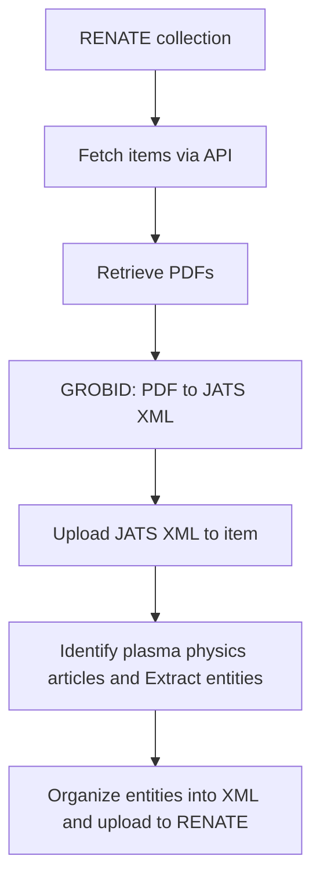

# PDF-to-XML and Plasma Physics Annotation Pipeline

This repository provides a pipeline for:

1. Collecting items from a **RENATE** collection
2. Downloading their PDFs
3. Converting PDFs to **JATS XML** using **GROBID**
4. Uploading the XML back to the item
5. Running **plasma physics NER** on relevant articles
6. Enriching item metadata with extracted entities

The pipeline is designed to be executed by a human operator using a simple shell script.

## Overview of the Pipeline



## Repository Structure

```
├── main.py
├── FileService.py
├── AnnotationService.py
├── AuthService.py
├── config_loader.py
├── trainedmodels/
│ ├── config.json
│ ├── model.safetensors
│ └── training_args.bin
├── teixml.xml
├── config.yml
└── README.md
```

## Requirements

### System Requirements
- Python **3.9+**

### Python Dependencies

requests

lxml

torch

transformers==4.49

torch_struct

tensorboardX

pyyaml


### GROBID Setup

This pipeline requires a running GROBID server.

#### Option 1 — Docker (recommended)

docker run -t --rm -p 8070:8070 lfoppiano/grobid:0.7.2

GROBID will be available at:

http://localhost:8070

The pipeline expects:

GROBID_API_URL = "http://localhost:8070/api/processFulltextDocument"

```
COLLECTION_ITEMS_ENDPOINT: "https://oa.tib.eu/renate/server/api/discover/search/objects?scope="
UPLOAD_BITSTREAMS_ENDPOINT: "https://oa.tib.eu/renate/server/api/core/bundles/{bundle_uuid}/bitstreams"
UPDATE_ITEMS_METADATA: "https://oa.tib.eu/renate/server/api/core/items/{item_uuid}"
```

### Running the Pipeline

python main.py

### Scripts Documentation

### Configuration File (`config.yaml`)

The `config.yaml` file contains all environment-specific settings required by the pipeline, including RENATE API endpoints, authentication credentials, and external service URLs such as GROBID.

Its primary purpose is to separate configuration from code, making the system easier to maintain, deploy, and switch between environments (e.g., test vs. production) without modifying source files.

The configuration contains two main environments:

- `test`: Used for RENATE test server development and validation
- `production`: Used for the live RENATE production server

Configure the active environment (`test` or `production`) by modifying:

`os.getenv("RENATE_ENV", "test")`

### Authorization for uploading files to RENATE

Authentication settings are handled in `AuthService`

### PDF-to-JATS XML Conversion and RENATE Upload (FileService)

This module retrieves PDF items from a RENATE repository, converts PDFs into JATS XML using GROBID, and uploads the generated XML back to RENATE. Given below are the detailes of implemented functions.

#### `pdf_to_xml`

Downloads a PDF from the given URL and sends it to the configured GROBID API for full-text processing.  
If GROBID returns TEI XML successfully, the TEI XML is converted into JATS XML using article metadata such as title, DOI, RENATE DOI, and license.

#### `convert_tei_to_jats`

Transforms a TEI XML document into JATS XML using the `teixml.xml` XSLT stylesheet.  
The function injects metadata fields such as article title, original DOI, RENATE DOI, license, and XML creation date into the generated JATS output.

#### `get_items_for_collection`

Retrieves all items from a RENATE collection using paginated API requests.  
The function follows the `next` links returned by the API and returns a list of item objects from the collection.

#### `get_item_information`

Fetches the full metadata and API information for a single RENATE item using its item UUID.  
This is useful when detailed information about a specific repository item is needed.

#### `get_item_content`

Retrieves the bundles attached to a repository item and finds the `ORIGINAL` bundle.  
It then extracts the available bitstreams from that bundle and returns the PDF/XML file information together with the bundle UUID.

#### `download_item_content`

Downloads the binary content of a PDF from the provided content URL.  
The function raises an error if the download request fails.

#### `upload_xml_to_renate`

Uploads a generated XML file to a RENATE bundle using an authenticated `requests.Session`.  
The uploaded file is named using the provided `name` value and attached to the corresponding bundle UUID.

#### `get_collection_items_by_handle`

Collects metadata for all candidate PDF items in a RENATE collection.  
For each item, it extracts title, DOI, RENATE DOI, license, keywords, bundle UUID, PDF URL, and information about existing JATS or annotation XML files.

#### `add_xmls_in_renate`

Main pipeline function for converting and uploading JATS XML files.  
It retrieves candidate collection items, skips items that already have a JATS XML file, converts missing PDFs into JATS XML, and uploads the generated XML back to RENATE.


### Plasma Physics Annotation Generation and RENATE Upload (AnnotationService)

This script reads JATS XML files from RENATE items, extracts article text, identifies low-temperature plasma papers, generates plasma-domain entity annotations, and uploads the resulting annotation XML back to RENATE. It also enriches item metadata with high-confidence extracted keywords. The trained models for generating plasma physics text annotations can be downloaded from the given link and put it in same folder.
https://drive.google.com/file/d/1ZJsaVHdGudrsSlsxU3zJwqDYqRUMf6qi/view?usp=sharing

#### `clean_keyword_objects`

Applies `clean_keyword()` to the `"text"` field of each entity object in a list.  
This is used to normalize extracted entities before saving or comparing them with existing keywords.

#### `label_ltp`

Classifies whether a paper is likely related to low-temperature plasma.  
It searches the title, abstract, and keywords for predefined LTP terms while excluding papers containing fusion or high-energy plasma terms.

#### `parse_jats_xml`

Downloads and parses a JATS XML file from a URL.  
It extracts the article title, abstract paragraphs, body sections, section paragraphs, and figure/table captions.

#### `updated_item_metadata`

Updates metadata for a RENATEitem using a JSON Patch payload.  
This is used to add extracted high-confidence subject keywords to the item metadata.

#### `build_ppann_xml`

Builds a custom annotation XML document for plasma physics entities.  
The XML contains source metadata such as DOI, RENATE DOI, and title, followed by sentence-level entity annotations with entity IDs, types, text, and optional offsets.

#### `create_and_add_annotations`

Main annotation pipeline for RENATE collection items.  
It retrieves items, skips those that already have annotation XML, parses JATS XML, extracts article text, generates entity annotations, updates metadata with high-confidence keywords, builds annotation XML, and uploads it back to RENATE.

